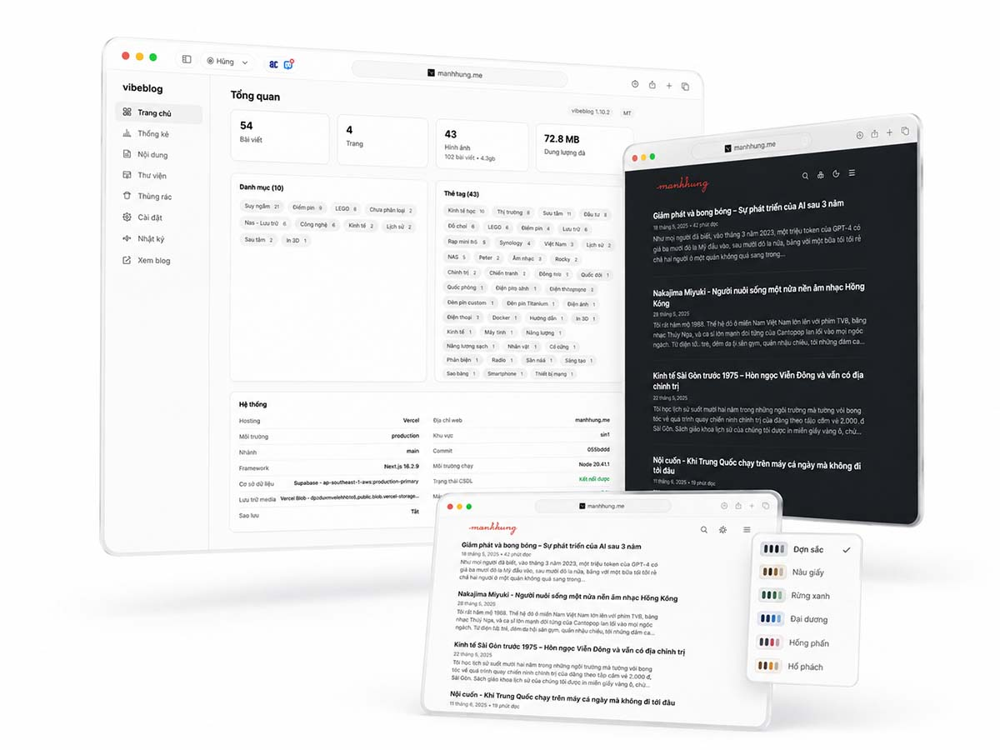

<div align="center">

# vibe**blog** &nbsp;`v1.1.0-beta`

**An AI-operated personal blog platform.**
Write and publish from a clean multilingual admin — or hand the keys to an AI agent and let it write, publish, and even deploy for you.

<br/>


[**🌐 Live demo**](https://manhhung.me) · [**Get your own copy**](#-get-your-own-copy) · [**Let an AI run it**](#-let-an-ai-agent-write--publish-mcp) · [**Architecture**](./ARCHITECTURE.md) · [**Roadmap**](./ROADMAP.md) · [**License**](#-license)

<sub>The demo at **manhhung.me** is the author's personal blog — a live instance to see the *platform* in action, not a content showcase (ignore what it says, look at how it works).</sub>

<br/>



</div>

---

## ✨ What it is

An **open-source** (MIT), single-owner blog built for people who just want to **write**. The public site is statically cached so it loads **insanely fast on mobile and desktop**, and it's tuned around **readable typography** — a clean reading experience first. Everything is **easy to tweak from the admin** (palettes, type, menu, fonts) with **no hardcoded values** anywhere, so you make it yours without touching code.

All the writing happens in a polished `/admin` (or over MCP). Text lives in **Supabase Postgres**, binaries (images, files, icons) in **Vercel Blob** — no git push to publish, no CMS to wrangle.

| Area | What you get |
|:---|:---|
| 🖋️&nbsp;**Editor** | TipTap 3 + Markdown · responsive `sharp` images (original + AVIF/WebP variants) · 3-version time machine · 60s autosave |
| 🎨&nbsp;**Look** | 6 customizable light+dark palettes · one tunable type system (per-role size/leading/tracking, no hardcoded sizes) · upload a custom font per weight |
| 🌍&nbsp;**i18n** | Admin + site in `en · vi · de · ja · zh · ko` |
| 🔍&nbsp;**Reading** | instant local + Postgres full-text search · ToC · related posts · reading time · progress bar |
| 📈&nbsp;**Built-in** | cookieless analytics (views / visitors / top pages, no PII) · activity log · soft-delete Trash (nothing auto-purges) |
| 🔎&nbsp;**SEO** | sitemap · RSS · `robots.txt` · `llms.txt` · dynamic OG images — all toggleable |
| 💾&nbsp;**Backups** | one-click full snapshots (DB + all binaries) to **Google Drive**, scheduled + restore |
| 🤖&nbsp;**MCP** | a remote endpoint that lets an AI agent write & manage the blog with the same rules as the admin |
| 📱&nbsp;**PWA** | installable, launches standalone |
| 🔐&nbsp;**Auth** | NextAuth v5 · Google sign-in · single authorized owner · edge-guarded admin/API |

> Built on **Next.js 16** (App Router, React 19, strict TS) + **Tailwind v4**, deployed on **Vercel**.

**Who it's for** — one person who wants a fast, good-looking, fully self-owned blog, is happy on Vercel + Supabase (Docker self-host is on the [Roadmap](./ROADMAP.md)), and likes the idea of letting an AI agent help run it.
**Not for** — multi-author teams / publications needing roles and editorial workflows. vibeblog is single-owner by design (one authorized email); multi-tenant lives in the planned SaaS, not here.

---

## 🚀 Get your own copy

Two ways to stand up your own blog — **pick one**. Both end with a live site at your domain.

<details open>
<summary><b>1️⃣ &nbsp;Do it yourself</b> &nbsp;— ~10 minutes in the dashboards</summary>

<br/>

1. **Fork** this repo (so Vercel deploys *your* copy).
2. **Database** — create a [Supabase](https://supabase.com) project → SQL Editor → paste [`scripts/schema.sql`](./scripts/schema.sql) → **Run** (idempotent). Copy the **Project URL** + **`service_role`** key (Settings → API).
3. **Import to Vercel** — *Add New → Project* → import your fork.
4. **Blob store** — *Storage → Create → Blob*, connect it to the project. This injects `BLOB_READ_WRITE_TOKEN` automatically.
5. **Env vars** (Settings → Environment Variables — see [the table](#-environment-variables)):
   `SUPABASE_URL`, `SUPABASE_SERVICE_ROLE_KEY`, `AUTH_SECRET` (`npx auth secret`), `AUTHORIZED_EMAIL`, `AUTH_GOOGLE_ID`, `AUTH_GOOGLE_SECRET`.
6. **Deploy.** Then on your [Google OAuth client](https://console.cloud.google.com/apis/credentials) add the redirect URI `https://<your-domain>/api/auth/callback/google`.
7. Open `https://<your-domain>/admin`, sign in as `AUTHORIZED_EMAIL`, set your title / palette / menu in **Settings**, and start writing.

</details>

<details open>
<summary><b>2️⃣ &nbsp;Hand it to an AI agent</b> &nbsp;— Claude, OpenAI Codex, OpenClaw, Hermes…</summary>

<br/>

Give an agent **Vercel + Supabase + GitHub access** (tokens / CLI / MCP), then paste:

```text
Deploy my own copy of github.com/joiha-steven/vibeblog:
1. Fork the repo to my account.
2. Create a Supabase project and run scripts/schema.sql in its SQL editor.
3. Create a Vercel project from the fork; add a Vercel Blob store (this sets BLOB_READ_WRITE_TOKEN).
4. Walk me step by step through creating a Google OAuth "Web" client
   (you can't log into my Google account, so guide me through the Cloud Console:
   create the project, configure the consent screen, create the OAuth client,
   and tell me exactly what to click), then collect the resulting
   AUTH_GOOGLE_ID and AUTH_GOOGLE_SECRET from me.
5. Set env vars: SUPABASE_URL, SUPABASE_SERVICE_ROLE_KEY (Supabase → Settings → API),
   AUTH_SECRET (generate with `npx auth secret`), AUTHORIZED_EMAIL=<my email>,
   AUTH_GOOGLE_ID and AUTH_GOOGLE_SECRET.
6. Deploy, then tell me to register https://<domain>/api/auth/callback/google
   as a redirect URI on the Google client.
7. Return the live URL.
```

> The agent does everything else; for the Google OAuth app it **walks you through the clicks** (it can't log into your Google account) and takes the client ID/secret back from you.

</details>

> [!TIP]
> Two `vercel.json` knobs to make yours: `regions` (defaults to `sin1`/Singapore — set your nearest) and `maxDuration: 60` for uploads (the free Hobby plan caps function time, so trim it or upgrade to Pro for big photos).

---

## 🤖 Let an AI agent write & publish (MCP)

vibeblog ships a remote **MCP** server, so a second AI agent can run your blog — drafting, editing, tagging, and **publishing straight to the live site**. No git, no deploy: content goes into Supabase + Blob through the same data layer (and same slug/revision/soft-delete rules) the admin uses.

1. **Turn it on** — *Admin → Settings → Advanced → MCP*, generate a named token (shown **once**, hashed at rest, expires in 180 days).
2. **Connect your agent** to the endpoint `https://<your-domain>/api/mcp` with `Authorization: Bearer <token>` (OAuth connectors are supported too).
3. **Prompt it**, e.g.:

```text
Using the vibeblog MCP server, write a 600-word post titled
"What I learned shipping a blog with an AI agent", give it the tags
"ai" and "writing", set a friendly excerpt, and publish it.
```

The post is live in seconds. Sensitive settings are blocked over MCP, and you stay the sole authority — revoke any token from the admin and it's gone.

---

## 🔑 Environment variables

See [`.env.example`](./.env.example). The essentials:

| Variable | Required | What it is · where to get it |
|---|:---:|---|
| `AUTH_SECRET` | ✅ | NextAuth secret — generate with `npx auth secret` |
| `AUTHORIZED_EMAIL` | ✅ | The only email allowed into `/admin` — your email |
| `AUTH_GOOGLE_ID` / `AUTH_GOOGLE_SECRET` | ✅ | Google OAuth "Web" client (admin sign-in) — [Cloud Console → Credentials](https://console.cloud.google.com/apis/credentials) |
| `SUPABASE_URL` | ✅ | Supabase project API URL — Supabase → Settings → API |
| `SUPABASE_SERVICE_ROLE_KEY` | ✅ | Supabase `service_role` key (secret, server-only) — same page |
| `BLOB_READ_WRITE_TOKEN` | ✅ auto | Vercel Blob token — **auto-injected** when you connect a Blob store; also derives the public Blob URL |
| `CRON_SECRET` | ◻️ optional | Protects `/api/cron` (keep-alive + scheduled backup) — any random string |
| `MCP_OAUTH_SECRET` | ◻️ optional | Signs MCP OAuth codes — random; falls back to `AUTH_SECRET` |
| `TURNSTILE_SITE_KEY` / `TURNSTILE_SECRET_KEY` | ◻️ optional | Cloudflare Turnstile anti-spam for comments — [Cloudflare → Turnstile](https://dash.cloudflare.com/?to=/:account/turnstile). Enable in Admin → Settings |

MCP tokens and the Google Drive backup connection are **created in the admin**, not via env. Secrets stay in `.env.local` (gitignored) + Vercel (`vercel env pull`); your blog content lives in Supabase + Blob, never in git.

---

## 🧑‍💻 Run locally (optional)

```bash
git clone https://github.com/joiha-steven/vibeblog.git && cd vibeblog
npm install
cp .env.example .env.local        # fill in the values above
npx auth secret                   # AUTH_SECRET
npm run dev                       # http://localhost:3000/admin
```

Point the same Supabase + Blob at local, and add `http://localhost:3000/api/auth/callback/google` to your Google client. `npm run check:all` must pass before any change is done (typecheck + lint + invariant checks + the vitest seam tests; offline, no creds); `npm run build` for a release.

---

## ⚙️ Using it

- `/` — public blog (published, date-reached posts) · `/category/<slug>`, `/tag/<slug>` (slugified) · header search overlay · path-based pagination (`/page/2`).
- `/admin` — dashboard, editor, media, analytics, settings (owner only).
- **Settings** is one form / one Save, three tabs — **General** (site, menu, reader features, SEO), **Appearance** (palettes, custom font, the per-role text-size table), **Advanced** (MCP, backups, custom CSS). Everything is injected as CSS variables, so changes apply site-wide with **no redeploy**.
- **Performance:** public pages are ISR-cached; every admin save purges exactly the affected pages through one place ([`src/lib/revalidate.ts`](./src/lib/revalidate.ts)), so edits are live next request without ever serving stale. Full design + the *why* in [`ARCHITECTURE.md`](./ARCHITECTURE.md).

---

## 🗺️ Roadmap

Docker self-host (pluggable S3/MinIO/local storage), publishing from Markdown note apps (Obsidian → Craft), and optional AI assist in the editor. See [`ROADMAP.md`](./ROADMAP.md).

---

## 📄 License

Two separate layers — keep them distinct:

- **Code (this repo) — [MIT](./LICENSE).** Free and open source: use, modify, redistribute, or sell it for any purpose, **no obligation to credit** (MIT only asks the license text travels with copies of the source). Fork it and run your own blog.
- **Content — © all rights reserved.** The writing published *with* vibeblog (articles, images on an operator's site, e.g. manhhung.me) belongs to its author, is **not** covered by MIT, does not live in this repo, and may not be reused without permission.

> In short: the **software** is open for anyone; the **author's writing** is not.
